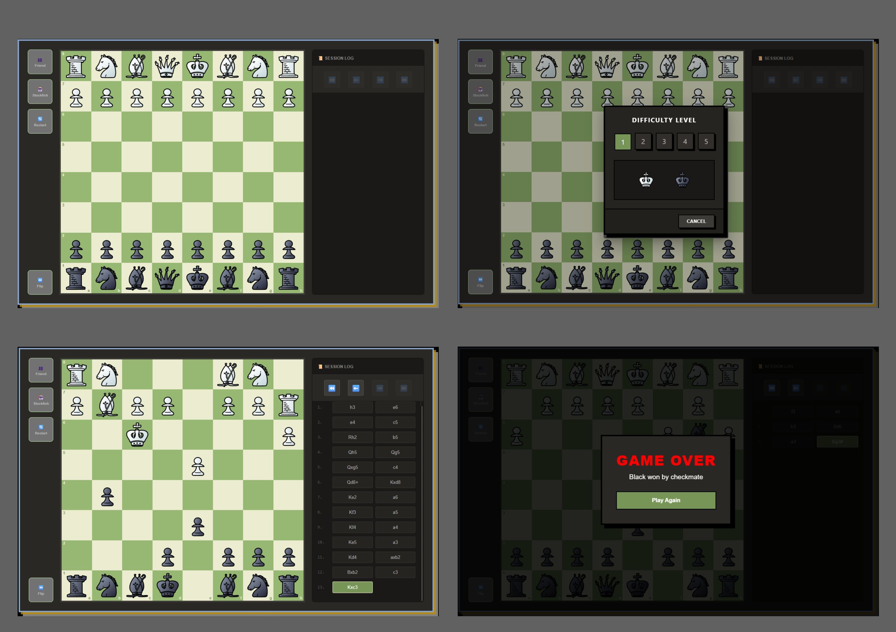

<div align="center">
  <br />
    <a>
      
    </a>

  <br />
  <h3 align="center">Chess</h3>
</div>

## <a name="table">Table of Contents</a>

1. [Introduction](#introduction)
2. [Project Structure](#project-structure)
3. [Quick Start](#quick-start)


## <a name="introduction">Introduction</a>

A recreation of classic chess built with Angular and TypeScript, integrating Stockfish API connectivity and FEN-driven board logic to deliver a fast, engine-backed competitive experience.


## <a name="project-structure">Project Structure</a>

```bash
chess/
├── src/
│   ├── main.ts
│   ├── chess.jpg
│   ├── index.html
│   ├── styles.css
│   ├── favicon.ico
│   ├── app/
│   │   ├── app.module.ts
│   │   ├── app.component.ts
│   │   ├── app.component.css
│   │   ├── app.component.html
│   │   ├── routes/
│   │   │   └── app-routing.module.ts
│   │   ├── chess-logic/
│   │   │   ├── models.ts
│   │   │   ├── chess-board.ts
│   │   │   ├── FENConverter.ts
│   │   │   └── pieces/
│   │   │        ├── king.ts
│   │   │        ├── pawn.ts
│   │   │        ├── rook.ts
│   │   │        ├── piece.ts
│   │   │        ├── queen.ts
│   │   │        ├── bishop.ts
│   │   │        └── knight.ts
│   │   ├── modules/
│   │   │   ├── nav-menu/
│   │   │   │     ├── nav-menu.component.ts
│   │   │   │     ├── nav-menu.component.css
│   │   │   │     └── nav-menu.component.html
│   │   │   ├── move-list/
│   │   │   │     ├── move-list.component.ts
│   │   │   │     ├── move-list.component.css
│   │   │   │     └── move-list.component.html
│   │   │   ├── chess-board/
│   │   │   │     ├── models.ts
│   │   │   │     ├── chess-board.service.ts
│   │   │   │     ├── chess-board.component.ts
│   │   │   │     ├── chess-board.component.css
│   │   │   │     └── chess-board.component.html
│   │   │   ├── play-against/
│   │   │   │     ├── play-against.component.ts
│   │   │   │     ├── play-against.component.css
│   │   │   │     └── play-against.component.html
│   │   │   └── computer-mode/
│   │   │   │     ├── models.ts
│   │   │   │     ├── stockfish.service.ts
│   │   │   │     └── computer-mode.component.ts
│   └── assets/
│       ├── sound/
│       └── pieces/
├── angular.json
├── package.json
└── package-lock.json
```

## <a name="quick-start">Quick Start</a>

```bash
# Clone the Repository
git clone https://github.com/sdulal412/chess.git
cd chess

# Install dependencies (only the first time)
npm install

# Runs the local on http://localhost:4200
ng serve

# Build the project (output path: dist/chess)
ng build
```